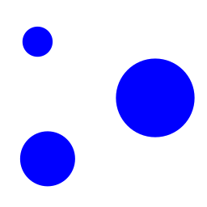
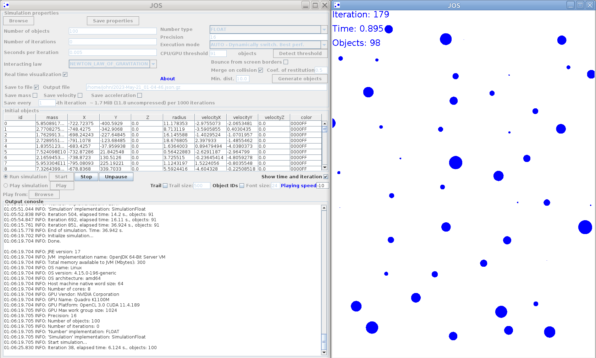
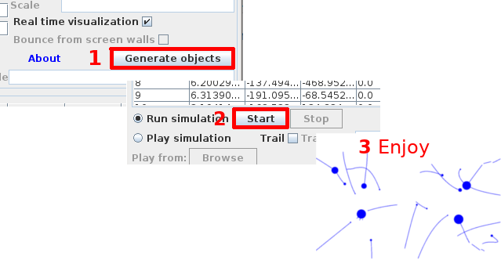

# JOS &nbsp; &nbsp;N-body Simulation in Java

**J**ava **O**bjects **S**imulation (**JOS**) is an N-body simulation system written in Java.

It offers **arbitrary precision** (alongside float and double) and three execution modes: CPU, GPU and Auto.

## Download
 - SourceForge: **[jos.jar](https://sourceforge.net/projects/jos-n-body/files/jos.jar/download)**
 
## Prerequisites
- JOS should be able to run on every system with **Java 1.8** or later installed, including Linux, Mac OS and Windows.
- If you want to use the GPU execution mode, be sure you have installed the **latest driver for your video card**.
 It should include OpenCL needed for the GPU.

## Sample simulations
[Accretion](samples/accretion.zip)

## Usage
0. Start the application by:
   1. Double-click on the jar file. (Execution permission needed.)
   2. If it doesn't start use the following command in the console: `java -jar jos.jar`
2. Click "**Generate objects**".
3. Click "**Start**".
4. Enjoy!

You can run the simulation **without visualization**, for faster computations, and **play it later**.

## Video card compatibility
To use the GPU execution mode you must have OpenCL compatible video card.

List of video cards on which the system is tested:
 - **Intel HD Graphics 530**: Float: **OK**, Double: **OK**
 - **Intel HD Graphics 5500**: Float: **OK**, Double: **NO**
 - **Intel HD Graphics 620**: Float: **OK**, Double: **OK**
 - **Intel Iris Plus**: Float: **OK**, Double: **NO**
 - **Intel Iris Xe**: Float: **OK**, Double: **NO**
 - **Intel UHD 620**: Float: **OK**, Double: **OK**
 - **Intel UHD 630**: Float: **OK**, Double: **OK**
 - **NVIDIA Quadro K1100M**: Float: **OK**, Double: **OK**
 - **NVIDIA GeForce GTX 960**: Float: **OK**, Double: **OK**
 - **NVIDIA GeForce GTX 1050**: Float: **OK**, Double: **OK**
 - **NVIDIA GeForce GTX 1050 Ti**: Float: **OK**, Double: **OK**
 - **NVIDIA GeForce GTX 1060**: Float: **OK**, Double: **OK**
 - **NVIDIA GeForce GTX 1070**: Float: **OK**, Double: **OK**
 - **NVIDIA GeForce GTX 1070 Ti**: Float: **OK**, Double: **OK**
 - **NVIDIA GeForce GTX 1650**: Float: **OK**, Double: **OK**
 - **NVIDIA GeForce GTX 1660**: Float: **OK**, Double: **OK**
 - **NVIDIA GeForce GTX 1660 Ti**: Float: **OK**, Double: **OK**
 - **NVIDIA GeForce GTX 850M**: Float: **OK**, Double: **OK**
 - **NVIDIA GeForce GTX 950**: Float: **OK**, Double: **OK**
 - **NVIDIA GeForce GTX 960**: Float: **OK**, Double: **OK**
 - **NVIDIA GeForce GTX 960M**: Float: **OK**, Double: **OK**
 - **NVIDIA GeForce MX150**: Float: **OK**, Double: **OK**
 - **NVIDIA GeForce MX330**: Float: **OK**, Double: **OK**
 - **NVIDIA GeForce MX350**: Float: **OK**, Double: **OK**
 - **NVIDIA GeForce MX450**: Float: **OK**, Double: **OK**
 - **NVIDIA GeForce RTX 2060**: Float: **OK**, Double: **OK**
 - **NVIDIA GeForce RTX 2070**: Float: **OK**, Double: **OK**
 - **NVIDIA GeForce RTX 2080**: Float: **OK**, Double: **OK**
 - **NVIDIA GeForce RTX 3050**: Float: **OK**, Double: **OK**
 - **NVIDIA GeForce RTX 3050 Ti**: Float: **OK**, Double: **OK**
 - **NVIDIA GeForce RTX 3060**: Float: **OK**, Double: **OK**
 - **NVIDIA GeForce RTX 3060 Ti**: Float: **OK**, Double: **OK**
 - **NVIDIA GeForce RTX 3070**: Float: **OK**, Double: **OK**
 - **NVIDIA GeForce RTX 3070 Ti**: Float: **OK**, Double: **OK**
 - **AMD Ellesmere**: Float: **OK**, Double: **OK**
 - **AMD gfx902**: Float: **OK**, Double: **OK**
 - **AMD gfx1010**: Float: **OK**, Double: **OK**
 - **AMD gfx1031**: Float: **OK**, Double: **OK**

## Description
The application had been initially written in C++ and OpenGL in 2009.

The idea was to have a simulation system which can use different interaction laws to calculate the force emerging between the objects.

It was used with:
 - Coulomb's law
 - Variation of Method of mirror charges between electrically charged spheres
 - Newton's law of universal gravitation

Current version implements only **Newton's law** and is written in Java.

Three types of **number precision** are supported float (single precision), double precision
and arbitrary precision.
For this the application introduces an abstraction for numbers
 which allows you to choose which implementation to use: Java primitive types **float** and **double**,
  or arbitrary precision **[ApFloat](http://www.apfloat.org/apfloat_java/)**.

There are three **execution modes**: CPU, GPU and Auto.
 - CPU uses the main processor and supports all three number precisions.
 - GPU runs on video card. Most decent video cards support OpenCL and at least float.
 - AUTO mode switches from GPU to CPU when the number of objects drops (on merging) below particular threshold.

Current version **does not use Z coordinate** of the objects. This is done
for faster calculations but can be easily changed.

For GUI the application uses **Swing** and **Java 2D Graphics**. Current visualization is 2D only.

**[Aparapi](https://aparapi.com/)** library is used for GPU computations.

You can save/load simulation **properties** using **JSON** format.

You can also save/load the **simulation run** itself and play it later. This is done again in
JSON but the file is **GZipped** to be smaller. You can unzip it with any archiver supporting gzip and read the values for
a particular iteration and object.

### Simulation properties (input) file format
<pre style='color:#1f1c1b;background-color:#ffffff;'>
<b>{</b>
  &quot;properties&quot;<b>:{</b>
    &quot;numberOfIterations&quot;<b>:</b>0<b>,</b>                       # Zero means no limit
    &quot;secondsPerIteration&quot;<b>:</b>0.001<b>,</b>
    &quot;numberOfObjects&quot;<b>:</b>2<b>,</b>
    &quot;outputFile&quot;<b>:</b>&quot;2022-Feb-07_00-26-53.json.gz&quot;<b>,</b>  # Where to save the simulation run
    &quot;saveToFile&quot;<b>:</b><b>true</b><b>,</b>                            # Whether to save the simulation run
    &quot;saveEveryNthIteration&quot;<b>:</b> 100<b>,</b>                 # Will save only every 100th iteration. This way the output file will be much smaller.
    &quot;saveMass&quot;<b>:</b> <b>false</b><b>,</b>                            # Whether to save the mass of the obejcts in the output file.
    &quot;saveVelocity&quot;<b>:</b> <b>false</b><b>,</b>                        # Whether to save the velocity.
    &quot;saveAcceleration&quot;<b>:</b> <b>false</b><b>,</b>                    # Whether to save the acceleration.
    &quot;numberType&quot;<b>:</b>&quot;DOUBLE&quot;<b>,</b>                        # What type to use for numbers. GPU version works with DOUBLE only
    &quot;interactingLaw&quot;<b>:</b>&quot;NEWTON_LAW_OF_GRAVITATION&quot;<b>,</b> # Current version (1.0.0) supports only NEWTON_LAW_OF_GRAVITATION
    &quot;precision&quot;<b>:</b>32<b>,</b>                               # Numbers precision. Used by BigDecimal and ApFloat
    &quot;realTimeVisualization&quot;<b>:</b><b>true</b><b>,</b>                 # Whether to visualize during simulation run. If true<b>,</b> runs slower
    &quot;playingSpeed&quot;<b>:</b>0<b>,</b>                             # If playingSpeed &lt; 0<b>:</b> every iteration sleep playingSpeed milliseconds.
                                                  # If playingSpeed &gt;= 0: visualize every playingSpeed milliseconds.
    &quot;bounceFromScreenBorders&quot;: <b>false</b><b>,</b>             # If true<b>,</b> objects will bounce from the screen borders.
    &quot;mergeOnCollision&quot;<b>:</b> <b>false</b><b>,</b>
    &quot;coefficientOfRestitution&quot;<b>:</b> &quot;0.8&quot;<b>,</b>            # Coefficient of restitution. 1<b>:</b> elastic<b>,</b> 0<b>:</b> perfectly inelastic<b>,</b> above 1<b>:</b> objects will gain energy on collision.
    &quot;minimumDistance&quot;<b>:</b> &quot;10.0&quot;<b>,</b>                    # If distance between objects centers < minimumDistance, minimumDistance will be used on acceleration calculation.
    &quot;initialObjects&quot;:<b>[</b>
      <b>{</b>
        &quot;id&quot;<b>:</b>&quot;0&quot;<b>,</b>                                 # Unique id of the object
        &quot;x&quot;<b>:</b>-200<b>,</b>                                 # Position of the centre
        &quot;y&quot;<b>:</b>0<b>,</b>
        &quot;z&quot;<b>:</b>0<b>,</b>
        &quot;velocityX&quot;<b>:</b>-4<b>,</b>                           # Metre per second (m/s)
        &quot;velocityY&quot;<b>:</b>-2.5<b>,</b>
        &quot;velocityZ&quot;<b>:</b>0.0<b>,</b>
        &quot;accelerationX&quot;<b>:</b> &quot;-8.003695&quot;<b>,</b>             # Current acceleration
        &quot;accelerationY&quot;<b>:</b> &quot;34.10966&quot;<b>,</b>
        &quot;accelerationZ&quot;<b>:</b> &quot;0&quot;<b>,</b>
        &quot;mass&quot;<b>:</b>1E17<b>,</b>                              # Kilogram (kg)
        &quot;radius&quot;<b>:</b>80                               # Metre (m)
        &quot;color&quot;:&quot;0000FF&quot;<b>,</b>                         # Blue
      <b>}</b><b>,</b>
      <b>{</b>
        &quot;id&quot;<b>:</b>&quot;1&quot;<b>,</b>
        &quot;x&quot;<b>:</b>200<b>,</b>
        &quot;y&quot;<b>:</b>0<b>,</b>
        &quot;z&quot;<b>:</b>0<b>,</b>
        &quot;velocityX&quot;<b>:</b>-1.5<b>,</b>
        &quot;velocityY&quot;<b>:</b>3<b>,</b>
        &quot;velocityZ&quot;<b>:</b>0.0<b>,</b>
        &quot;accelerationX&quot;<b>:</b> &quot;-9.364132&quot;<b>,</b>
        &quot;accelerationY&quot;<b>:</b> &quot;14.401725&quot;<b>,</b>
        &quot;accelerationZ&quot;<b>:</b> &quot;0&quot;<b>,</b>
        &quot;mass&quot;<b>:</b>2E17<b>,</b>
        &quot;radius&quot;<b>:</b>70<b>,</b>
        &quot;color&quot;<b>:</b>&quot;FF0000&quot;<b>,</b>                         # Red
      <b>}</b>
    <b>]</b>
  <b>}</b>
<b>}</b>
</pre>

## Source code description (for developers)
There is a lot of things which are not finished or implemented (such as viewport navigation),
but the main functionality is there.

For GPU mode, the main
calculations are translated from byte code to OpenCL. This is done by
Aparapi library. This code is located in methods:
 - SimulationLogicImpl.**calculateNewValues**(int i);
 - CollisionCheck.**run**();

!!! DO NOT CHANGE THESE METHODS and methods called from them if you don't have experience with Aparapi library!!!

Even adding a simple **break;** statement will cause translation failure and the code will execute on the CPU. Read more here: 
[Aparapi Java Kernel Guidelines](https://aparapi.com/documentation/kernel-guidelines.html).

There is **Number** interface which almost entirely duplicates BigDecimal methods signatures.
 I've written it in 2015, but I was
not aware of java.lang.Number which was introduced a year earlier I think. 
However java.lang.Number is very simple and doesn't help in our case.

The interface has three implementations:
 - FloatNumberImpl
 - DoubleNumberImpl
 - ApfloatNumberImpl

I'll not explain the parts of the system in details here. Instead, let me
give you some simple steps for **compiling and running** the project.

JOS is a **maven** project. I've used **Java Swing** and IntelliJ GUI builder for the GUI.
You should be able to import it as a maven project in your favorite IDE.
 - To run it from source code you can use: `mvn clean compile exec:java`
 - To package as a single JAR file with dependencies use:
   - `mvn clean install`
   - `mvn assembly:single`
 - You can run the JAR with: `java -jar jos.jar`

## Contributing to JOS
### TODO List
- Implement simulation generator using formula for placing objects in more
complex structures or create GUI for that.
- Implement tests.
- Fix viewport navigation during visualization.
- Implement video recording of the simulation.
- Implement 3D visualization.

 If you can implement anything from the TODO list, or you want to fix a bug
 you are welcome to contribute.
   
To do that, follow these steps:

1. Fork this repository.
2. Create a branch: `git checkout -b <branch_name>`.
3. Make your changes and commit them: `git commit -m '<commit_message>'`
4. Push to the original branch: `git push origin <project_name>/<location>`
5. Create a pull request.

Alternatively see the GitHub documentation on [creating a pull request](https://help.github.com/en/github/collaborating-with-issues-and-pull-requests/creating-a-pull-request).

## Contact
If you find an error, something looks incorrect or just have a suggestion please write me.

Trayan Momkov

## License
[Apache License 2.0](LICENSE)