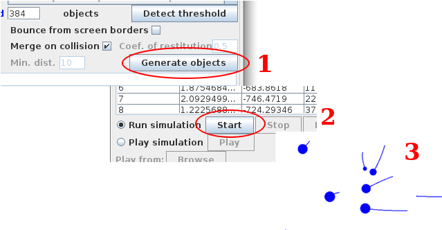

# JOS  N-body Simulation in Java

**J**ava **O**bjects **S**imulation (**JOS**) is an N-body simulation system written in Java.

## Download
 - GPU version: **[jos.jar]()** - Faster. Main calculations run on video card. Limited precision. Compatible video card required.
 - CPU version: **[jos-cpu.jar]()** - Slower. Runs on CPU. Arbitrary precision.
 
## Prerequisites
- JOS should run on every system with **Java 8** or later installed, including Linux, Mac OS and Windows.
- Be sure you have installed the **latest driver for your video card**. It should include OpenCL needed for the GPU version.

## Usage
0. Start the application. 
   1. Double click on the jar file.
   2. If doesn't start use the following command in the console: `java -jar jos.jar`
2. Click "**Generate objects**".
3. Click "**Start**".
4. Enjoy!

## Video card compatibility
GPU version **jos.jar** does not run on every video card.
 If you experience any problem, please try the CPU version: [jos.jar]()

Please help me to create a list with compatible video cards. Tell me what is yours
 and whether there is a problem or everything is running fine.
 
If you see the following message when you start a simulation:
`Simulation logic execution mode = GPU` then everything is fine.

List of video cards on which the system is tested:
 - **NVIDIA Quadro K1100M**: **OK**

## Description
The application had been initially written in C++ and OpenGL in 2009.

The idea was to have a simulation system which can use different interaction laws to calculate the force emerging between the objects.

It was used with:
 - Coulomb's law
 - Variation of Method of mirror charges between electrically charged spheres
 - Newton's law of universal gravitation

Current version implements only **Newton's law** and is written in Java.

For GUI it uses **Swing** and **Java 2D Graphics**.

**[Aparapi](https://aparapi.com/)** library is used for GPU computations.

The version which is running only on the CPU (jos-cpu.jar) introduces an abstraction for numbers
 which allows you to choose which implementation to use: primitive type **double**,
  common **BigDecimal** or arbitrary precision **[ApFloat](http://www.apfloat.org/apfloat_java/)**.

If you need precise numbers try ApFloat. My experience shows that it 
is faster than BigDecimal.

You can save/load simulation **properties** using **JSON** format.

You can also save/load the **simulation run** itself. This is done again in
JSON but the file is **GZipped** to be smaller. You can unzip the output
file with any archiver supporting gzip and read the values for
a particular iteration and object.

### Input/Output files format

## Source code description (for developers)
There is a lot of things which are not finished or implemented (such as viewport navigation),
but the main functionality is there.

The design of the application is not the best one. Especially in **master** branch
where GPU is used for computations. One of the reason is that the main
calculations have to be translated from byte code to OpenCL. This is done by
Aparapi library.

Main calculations translated to OpenCL are in methods:
 - SimulationLogicImpl.**calculateNewValues**(int i);
 - CollisionCheck.**run**();

!!! DO NOT CHANGE THESE METHODS and methods called from them if you don't have experience with Aparapi library!!!

The branch which uses CPU is called **arbitrary_precision** and as its name
suggests, it offers arbitrary precision for arithmetic calculations.
Design of this branch is better. There is **Number** interface which
has four implementations:
 - FloatNumberImpl
 - DoubleNumberImpl
 - BigDecimalNumberImpl
 - ApfloatNumberImpl

I'll not explain the parts of the system in details here. Instead, let me
give you some useful steps to compile and run the project.

JOS is **maven** project. I've used **Java Swing** and IntelliJ GUI builder for the GUI.
You should be able to import it as a maven project in your favorite IDE.
 - To run it from source code you can use: `mvn clean compile exec:java`
 - To package as a single JAR file with dependencies use: `mvn assembly:single`
 - You can run the JAR with: `java -jar jos.jar`

## Contributing to JOS
### TODO List
- Implement tests
- Fix viewport navigation during visualization
- Implement object bouncing from each other using coefficient of restitution
- Implement video recording of the simulation
- Implement simulation generator using formula for placing objects in more
complex structures or create GUI for that

 If you can implement anything from the TODO list or you want to fix a bug
 you are welcome to contribute.
   
To do that, follow these steps:

1. Fork this repository.
2. Create a branch: `git checkout -b <branch_name>`.
3. Make your changes and commit them: `git commit -m '<commit_message>'`
4. Push to the original branch: `git push origin <project_name>/<location>`
5. Create a pull request.

Alternatively see the GitHub documentation on [creating a pull request](https://help.github.com/en/github/collaborating-with-issues-and-pull-requests/creating-a-pull-request).

## Contact
If you find an error, something looks incorrect or just have a suggestion please write me.

Trayan Momkov

## License
[Apache License 2.0](LICENSE)